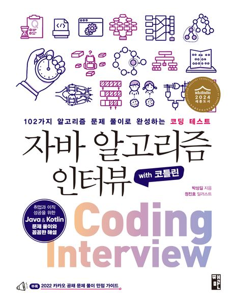

# 알고리즘 스터디

자바(Java) 기반의 알고리즘 문제 풀이 저장소입니다. 백준(BOJ), 프로그래머스, 리트코드 등의 문제를 사이트별/분류별로 정리하고, 문제 폴더마다 자동으로 README를 생성합니다.

## 폴더 구조

- `src/problems`:
  - 사이트/분류/문제 폴더 구조. 예: `src/problems/baekjoon/string/BOJ_1157_단어공부`
  - 문제 폴더에는 `Solution*.java`, `metrics.json`, `README.md`가 위치합니다.
- `tools`:
  - `genproblem.sh`: 문제 폴더에서 `metrics.json` 생성 및 문제 `README.md` 자동 생성
  - `generate_readme.py`: 문제 `README.md` 생성기(직접 실행 가능)
- `src/algo`, `src/util`, `src/app`, `src/playground`: 공용 알고리즘/유틸/실행 테스트 코드 등

## 문제 폴더 네이밍 규칙

- 기본: `SITE_NUM_TITLE` 형태 권장 (예: `BOJ_1157_단어공부`)
- 접두사가 없더라도 `NUM_TITLE`, `NUM`도 인식합니다.

## README 자동 생성

문제 폴더를 찾은 뒤, `metrics.json`이 없으면 템플릿을 생성하고 `README.md`를 만듭니다.

### 쉘 스크립트 사용(genproblem.sh)

```bash
bash tools/genproblem.sh <문제번호> [태그] [요약] [입력예시] [출력예시]

# 예시
bash tools/genproblem.sh 1157 "문자열, 구현" "" "" ""
```

### 파이썬 스크립트 직접 사용(generate_readme.py)

```bash
python3 tools/generate_readme.py <문제번호> \
  --tags "문자열, 구현" \
  --summary "힌트: 입력 범위·핵심 규칙·자료구조·에지 케이스를 한 줄로 요약" \
  --input "예시 입력" \
  --output "예시 출력"
```

## metrics.json

문제 폴더 내 `metrics.json`은 각 `Solution*.java`에 대한 메타데이터를 기록합니다.

- 필드: `file`, `memory_kb`, `time_ms`, `time_complexity`, `idea`
- 초기 생성 시 기본값이 채워지며, 제출/측정 결과에 따라 수동 갱신하세요.

## 문제 README 표 구성

문제 `README.md`의 “풀이 파일 & 성능” 표는 다음을 포함합니다.

- 작성일(오름차순)
- 풀이 파일(상대 링크로 GitHub에서 클릭 시 해당 파일로 이동)
- 메모리/실행시간/시간복잡도/핵심 아이디어

작성일은 파일 생성시간이 지원되지 않는 환경에선 수정시간으로 대체됩니다.

## 새 문제 추가 가이드

1. 폴더 생성: 예) `src/problems/baekjoon/sorting/BOJ_2750_수정렬하기/`
2. 풀이 파일 추가: `Solution.java` 또는 복수 풀이 시 `SolutionArray.java` 등
3. README 생성 실행:

```bash
bash tools/genproblem.sh 2750 "정렬" "" "예시 입력" "예시 출력"
```

## 기타

- 링크 자동화: 사이트/경로를 기반으로 BOJ/Programmers/LeetCode 링크를 추론합니다.
- 표의 파일명은 상대 링크(`[파일](./파일)`)로 생성되어 GitHub에서 바로 열 수 있습니다.

---

## 참고 도서

<details>
<summary><strong>자바 알고리즘 인터뷰 with 코틀린 : 102가지 알고리즘 문제 풀이로 완성하는 코딩 테스트 — 박상길 저</strong></summary>

<p align="center">
  
</p>

- [1부] 코딩 인터뷰를 준비하며

  - 1장 코딩 인터뷰 & 코딩 테스트
    - 기업 인재 등용의 관문, 코딩 인터뷰
    - 코딩 인터뷰와 국내외 기업들의 평가 기준
    - 국내 기업들의 코딩 테스트 플랫폼 활용 현황
    - 온라인 코딩 테스트의 사전 준비 사항
      - 연습장과 필기 도구
      - 어떤 프로그래밍 언어가 유리할까
      - 자신만의 코드 스니펫 준비
      - 모든 테스트 케이스를 통과하도록 풀어야 한다
      - 타임아웃이 발생하는 경우
      - 예외 처리를 잊지 말자
      - 잘못 접근한 풀이, 어떻게 대처할까
      - 코딩 도구가 필요할까
      - IDE에 부정적인 면접관이 있다면
      - REPL 도구로 코드를 검증하자
    - 온라인 코딩 테스트 플랫폼의 특징과 활용
      - 리트코드
      - 프로그래머스

- [2부] 자바 & 코틀린

  - 2장 자바, 세상에서 가장 유명한 언어
    - 자바의 역사
    - 자바의 주요 특징
      - 객체 지향 프로그래밍 언어
      - 함수형 프로그래밍 언어
    - 자바의 도구
      - 즉시 실행 가능한 JShell
      - 자바는 어떻게 빌드하고 어떻게 실행할까
    - JVM 기반 언어의 등장
  - 3장 코틀린, 구글이 인정한 공식 언어
    - 코틀린의 주요 특징
      - 실용성
      - 상호운용성
      - 안전성
      - 우아함
    - 코틀린의 기본 문법
      - 깔끔한 for 반복문
      - 정갈한 when 조건문
      - 편리한 함수 선언
      - 함수형 프로그래밍 언어
      - 가시성 제어자
      - 확장 함수
    - 코틀린은 어떻게 빌드하고 어떻게 실행할까
      - 코틀린은 과연 느릴까
  - 4장 자료형
    - 자바는 어떤 자료형을 제공할까
      - 원시 자료형
      - 참조 자료형
      - 원시 자료형과 참조 자료형의 속도 비교
    - 자바 컬렉션 프레임워크의 등장
      - 가장 자주 쓰게 될 리스트
      - 가장 유용하게 쓰게 될 맵
    - 초기 자료형의 성능 문제
    - 무한대 크기의 숫자를 저장할 수 있는 자료형
    - 코틀린은 어떤 자료형을 제공할까
      - 코틀린 자료형의 속도는 과연 빠를까
    - 코틀린은 컬렉션 프레임워크를 어떻게 구현했을까
      - 클래스의 기능을 확장하는 코틀린의 확장 함수
      - 코틀린이 별도로 구현한 컬렉션 인터페이스
    - 자바 컬렉션 프레임워크의 실행 속도
  - 5장 빅오
    - 빅오
      - n2과 2n의 비교
      - 빅오를 계산하는 실용적인 방법
      - 상한과 최악
      - 분할 상환 분석
      - 병렬화
      - 복잡도의 특징
    - 자바 컬렉션 프레임워크의 빅오
      - 리스트 시간 복잡도
      - 맵 시간 복잡도
    - 데크 시간 복잡도
  - 6장 문자열 처리
    - [문제01] 유효한 팰린드롬
    - [문제02] 문자열 뒤집기
    - [문제03] 로그 파일 재정렬
    - [문제04] 가장 흔한 단어
    - [문제05] 그룹 애너그램
    - [문제06] 가장 긴 팰린드롬 부분 문자열

- [3부] 선형 자료구조

  - 7장 배열
    - 동적 배열
    - [문제07] 두 수의 합
    - [문제08] 빗물 트래핑
    - [문제09] 세 수의 합
    - [문제10] 배열 파티션 I
    - [문제11] 자신을 제외한 배열의 곱
    - [문제12] 주식을 사고팔기 가장 좋은 시점
  - 8장 연결 리스트
    - [문제13] 팰린드롬 연결 리스트
    - [문제14] 두 정렬 리스트의 병합
    - [문제15] 역순 연결 리스트
    - [문제16] 두 수의 덧셈
    - [문제17] 페어의 노드 스왑
    - [문제18] 홀짝 연결 리스트
    - [문제19] 역순 연결 리스트 II
  - 9장 스택, 큐
    - 스택
    - 큐
    - 자바에서 활용하기
      - 자바의 큐 선언
      - 자바의 스택 선언
      - 스레드 안전이 필요한 경우
    - [문제20] 유효한 괄호
    - [문제21] 중복 문자 제거
    - [문제22] 일일 온도
    - [문제23] 큐를 이용한 스택 구현
    - [문제24] 스택을 이용한 큐 구현
    - [문제25] 원형 큐 디자인
  - 10장 데크, 우선순위 큐
    - 데크
    - [문제26] 원형 데크 디자인
    - 우선순위 큐
    - [문제27] k개 정렬 리스트 병합
    - [문제28] 원점에서 가장 가까운 k개의 점
    - [문제29] 더 맵게
  - 11장 해시 테이블
    - 해시
      - 생일 문제
      - 비둘기집 원리
      - 로드 팩터
      - 해시 함수
    - 충돌
      - 개별 체이닝
      - 오픈 어드레싱
      - 언어별 해시 테이블 구현 방식
    - [문제30] 해시맵 디자인
    - [문제31] 보석과 돌
    - [문제32] 중복 문자 없는 가장 긴 부분 문자열
    - [문제33] 상위 k 빈도 엘리먼트
    - [문제34] 완주하지 못한 선수

- [4부] 비선형 자료구조

  - 12장 그래프
    - 오일러 경로
    - 해밀턴 경로
    - 그래프 순회
      - DFS(깊이 우선 탐색)
      - BFS(너비 우선 탐색)
    - 백트래킹
    - 제약 충족 문제
    - [문제35] 섬의 개수
    - [문제36] 전화번호 문자 조합
    - [문제37] 순열
    - [문제38] 조합
    - [문제39] 조합의 합
    - [문제40] 부분집합
    - [문제41] 일정 재구성
    - [문제42] 여행 경로
    - [문제43] 코스 일정
  - 13장 최단 경로 문제
    - [문제44] 네트워크 딜레이 타임
    - [문제45] k 경유지 내 가장 저렴한 항공권
    - [문제46] 게임 맵 최단 거리
  - 14장 트리
    - 트리의 각 명칭
    - 그래프와 트리의 차이점
    - 이진 트리
    - [문제47] 이진 트리의 최대 깊이
    - [문제48] 이진 트리의 직경
    - [문제49] 가장 긴 동일 값의 경로
    - [문제50] 이진 트리 반전
    - [문제51] 두 이진 트리 병합
    - [문제52] 이진 트리 직렬화 & 역직렬화
    - [문제53] 균형 이진 트리
    - [문제54] 최소 높이 트리
    - 이진 탐색 트리(BST)
      - 자가 균형 이진 탐색 트리
    - [문제55] 정렬된 배열의 이진 탐색 트리 변환
    - [문제56] 이진 탐색 트리(BST)를 더 큰 수 합계 트리로
    - [문제57] 이진 탐색 트리(BST) 합의 범위
    - [문제58] 이진 탐색 트리(BST) 노드 간 최솟값
    - 트리 순회
      - 전위 순회
      - 중위 순회
      - 후위 순회
    - [문제59] 전위, 중위 순회 결과로 이진 트리 구축
  - 15장 힙
    - 힙 연산
      - 삽입
      - 추출
    - [문제60] 배열의 k번째 큰 엘리먼트
    - [문제61] 이중 우선순위 큐
  - 16장 트라이
    - [문제62] 트라이 구현
    - [문제63] 팰린드롬 페어

- [5부] 알고리즘

  - 17장 정렬
    - 버블 정렬
    - 삽입 정렬
    - 병합 정렬
    - 퀵 정렬
    - 안정 정렬과 불안정 정렬
    - [문제64] 리스트 정렬
    - [문제65] 구간 병합
    - [문제66] 삽입 정렬 리스트
    - [문제67] 가장 큰 수
    - [문제68] 유효한 애너그램
    - [문제69] 색 정렬
  - 18장 이진 검색
    - [문제70] 이진 검색
    - [문제71] 회전 정렬된 배열 검색
    - [문제72] 두 배열의 교집합
    - [문제73] 두 수의 합 II
    - [문제74] 2D 행렬 검색 II
    - [문제75] 입국심사
  - 19장 비트 조작
    - 부울 연산자
    - 비트 연산자
    - 비트 조작 퀴즈
      - 자릿수 제한 비트 연산
    - 2의 보수
      - 2의 보수 숫자 표현
      - 비트 연산자 NOT
    - [문제76] 싱글 넘버
    - [문제77] 해밍 거리
    - [문제78] 두 정수의 합
    - [문제79] UTF-8 검증
    - [문제80] 1비트의 개수
  - 20장 슬라이딩 윈도우
    - [문제81] 최대 슬라이딩 윈도우
    - [문제82] 부분 문자열이 포함된 최소 윈도우
    - [문제83] 가장 긴 반복 문자 대체
  - 21장 그리디 알고리즘
    - 배낭 문제
    - 동전 바꾸기 문제
    - 가장 큰 합
    - [문제84] 주식을 사고팔기 가장 좋은 시점 II
    - [문제85] 키에 따른 대기열 재구성
    - [문제86] 태스크 스케줄러
    - [문제87] 주유소
    - [문제88] 쿠키 부여
  - 22장 분할 정복
    - [문제89] 과반수 엘리먼트
    - [문제90] 괄호를 삽입하는 여러 가지 방법
  - 23장 다이나믹 프로그래밍
    - 최적 부분 구조
    - 중복된 하위 문제들
    - 다이나믹 프로그래밍 방법론
      - 상향식
      - 하향식
    - [문제91] 피보나치 수
    - 0-1 배낭 문제
    - [문제92] 최대 서브 배열
    - [문제93] 계단 오르기
    - [문제94] 집 도둑
    - [문제95] 도둑질

- 부록 2022년 카카오 공채 만점 가이드
  - [문제96] 신고 결과 받기
  - [문제97] k진수에서 소수 개수 구하기
  - [문제98] 주차 요금 계산
  - [문제99] 양궁대회
  - [문제100] 양과 늑대
  - [문제101] 파괴되지 않은 건물
  - [문제102] 사라지는 발판

</details>

<!-- AUTO_INDEX:START -->

## 문제

<details>
<summary><strong>dfs</strong></summary>

<details>
<summary>BOJ 6443 애너그램</summary>

| 업데이트 | 파일 이름 | 문제 링크 |
|---|---|---|
| [2025-09-18 10:42:56](./src/problems/baekjoon/dfs/BOJ_6443_애너그램) | [Solution.java](./src/problems/baekjoon/dfs/BOJ_6443_애너그램/Solution.java) | [문제 링크](https://www.acmicpc.net/problem/6443) |
</details>

</details>

<details>
<summary><strong>sorting</strong></summary>

<details>
<summary>BOJ 1181 단어정렬</summary>

| 업데이트 | 파일 이름 | 문제 링크 |
|---|---|---|
| [2025-09-14 13:16:20](./src/problems/baekjoon/sorting/BOJ_1181_단어정렬/README.md) | [Solution.java](./src/problems/baekjoon/sorting/BOJ_1181_단어정렬/Solution.java) | [문제 링크](https://www.acmicpc.net/problem/1181) |
</details>

<details>
<summary>BOJ 2751 단어정렬2</summary>

| 업데이트 | 파일 이름 | 문제 링크 |
|---|---|---|
| [2025-09-14 13:16:32](./src/problems/baekjoon/sorting/BOJ_2751_단어정렬2) | [Solution.java](./src/problems/baekjoon/sorting/BOJ_2751_단어정렬2/Solution.java) | [문제 링크](https://www.acmicpc.net/problem/2751) |
</details>

<details>
<summary>BOJ 2750 수정렬하기</summary>

| 업데이트 | 파일 이름 | 문제 링크 |
|---|---|---|
| [2025-09-14 13:16:10](./src/problems/baekjoon/sorting/BOJ_2750_수정렬하기) | [Solution.java](./src/problems/baekjoon/sorting/BOJ_2750_수정렬하기/Solution.java) | [문제 링크](https://www.acmicpc.net/problem/2750) |
</details>

</details>

<details>
<summary><strong>string</strong></summary>

<details>
<summary>BOJ 1157 단어공부</summary>

| 업데이트 | 파일 이름 | 문제 링크 |
|---|---|---|
| [2025-09-14 13:12:13](./src/problems/baekjoon/string/BOJ_1157_단어공부/README.md) | [SolutionArray.java](./src/problems/baekjoon/string/BOJ_1157_단어공부/SolutionArray.java) | [문제 링크](https://www.acmicpc.net/problem/1157) |
| [2025-09-14 13:12:19](./src/problems/baekjoon/string/BOJ_1157_단어공부/README.md) | [SolutionHashMap.java](./src/problems/baekjoon/string/BOJ_1157_단어공부/SolutionHashMap.java) | [문제 링크](https://www.acmicpc.net/problem/1157) |
</details>

<details>
<summary>BOJ 6996 애너그램</summary>

| 업데이트 | 파일 이름 | 문제 링크 |
|---|---|---|
| [2025-09-16 15:29:39](./src/problems/baekjoon/string/BOJ_6996_애너그램/README.md) | [Solution.java](./src/problems/baekjoon/string/BOJ_6996_애너그램/Solution.java) | [문제 링크](https://www.acmicpc.net/problem/6996) |
</details>

<details>
<summary>BOJ 1919 에너그램</summary>

| 업데이트 | 파일 이름 | 문제 링크 |
|---|---|---|
| [2025-09-17 19:13:28](./src/problems/baekjoon/string/BOJ_1919_에너그램/README.md) | [Solution.java](./src/problems/baekjoon/string/BOJ_1919_에너그램/Solution.java) | [문제 링크](https://www.acmicpc.net/problem/1919) |
</details>

</details>

<details>
<summary><strong>two_pointer</strong></summary>

<details>
<summary>BOJ 3273 두수의합</summary>

| 업데이트 | 파일 이름 | 문제 링크 |
|---|---|---|
| [2025-09-18 16:11:13](./src/problems/baekjoon/two_pointer/BOJ_3273_두수의합/README.md) | [Solution.java](./src/problems/baekjoon/two_pointer/BOJ_3273_두수의합/Solution.java) | [문제 링크](https://www.acmicpc.net/problem/3273) |
</details>

<details>
<summary>BOJ 1806 부분합</summary>

| 업데이트 | 파일 이름 | 문제 링크 |
|---|---|---|
| [2025-09-20 16:22:25](./src/problems/baekjoon/two_pointer/BOJ_1806_부분합) | [Solution.java](./src/problems/baekjoon/two_pointer/BOJ_1806_부분합/Solution.java) | [문제 링크](https://www.acmicpc.net/problem/1806) |
</details>

<details>
<summary>BOJ 2003 수들의합2</summary>

| 업데이트 | 파일 이름 | 문제 링크 |
|---|---|---|
| [2025-09-20 14:31:24](./src/problems/baekjoon/two_pointer/BOJ_2003_수들의합2/README.md) | [Solution.java](./src/problems/baekjoon/two_pointer/BOJ_2003_수들의합2/Solution.java) | [문제 링크](https://www.acmicpc.net/problem/2003) |
</details>

<details>
<summary>BOJ 2018 수들의합5</summary>

| 업데이트 | 파일 이름 | 문제 링크 |
|---|---|---|
| [2025-09-24 14:25:17](./src/problems/baekjoon/two_pointer/BOJ_2018_수들의합5/README.md) | [Solution.java](./src/problems/baekjoon/two_pointer/BOJ_2018_수들의합5/Solution.java) | [문제 링크](https://www.acmicpc.net/problem/2018) |
| [2025-09-25 11:40:22](./src/problems/baekjoon/two_pointer/BOJ_2018_수들의합5/README.md) | [SolutionReTry.java](./src/problems/baekjoon/two_pointer/BOJ_2018_수들의합5/SolutionReTry.java) | [문제 링크](https://www.acmicpc.net/problem/2018) |
</details>

</details>

<!-- AUTO_INDEX:END -->
